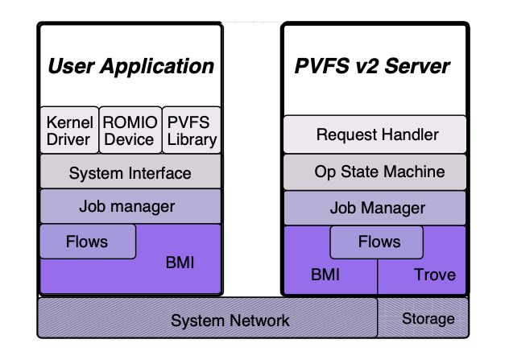
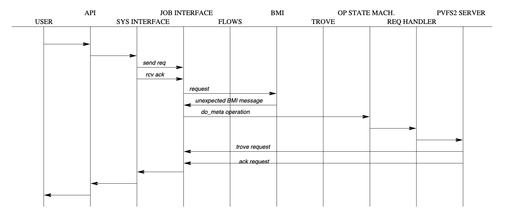

# PVFS2 Concepts: The new guy’s guide to PVFS

## Introduction

PVFS2 represents a complete redesign and reimplementation of the
parallel file system concepts in PVFS1. PVFS2 has new entities acting in
new ways on new objects. This document will serve as an introduction to
the terminology and concepts used in the other pvfs2 documents.

## Words

- ***system interface:*** low-level interface to PVFS. sits on top of the servers. provides underlying foundation to higher-level interfaces like the PVFS library ( libpvfs2 ) and the PVFS VFS interface.

- ***distributions:*** (also “file distributions”, “physical distribution” ) set of methods describing a mapping from a logical sequence of bytes to a physical layout of bytes on PVFS servers. PVFS1 had one type of distribution – regularly striding data. PVFS2 will understand many distributions, including but not limited to strided, block and cyclic.

- ***job:*** a PVFS operation requires several steps, called “jobs”

    - ***job interface:*** keeps track of progress as an operation makes its way through the pvfs2 layers

    - ***job structure:***

- ***BMI (Buffered Message Interface):*** abstracts network communication. Currently BMI supports TCP, Myricom/GM, and InfiniBand using either VAPI or OpenIB APIs. It has been extended to at least two other protocols not included in the distribution.

- ***flows:*** a flow describes the movement of file data from client initialization to putting bits on disk. It encompasses both transporting data over the network as well as interacting with storage devices. ( XXX: scheduler?). Users tell flow *what* they want done, and flow figures out *how* to accomplish the request. Flows are not involved in metadata operations.

    - ***flow interface:*** the API for setting up flows

    - ***flow protocol:*** Implements whatever underlying protocol is needed for two endpoints to communicate

    - ***flow endpoint:*** the source or destination of a flow

    - ***flow descriptor:*** data structure representing a flow

- ***trove:*** stores both keyword-value pairs and data (?)

    - *storage interface (obsolete):* now called *trove*

- ***system level objects:*** data files, metadata files, directories, symlinks

    - ***metadata:*** data about data. in the UNIX sense, such things as owner, group, permissions, timestamps, sizes. in the PVFS sense, also distribution information.

    - ***data:*** actual contents of file

    - ***metafile:*** contains the metadata for a single PVFS file

    - ***datafile:*** contains some portion of the data for a single PVFS file

- ***dataspace:*** logical collections of data

    - ***bytestream:*** arbitrary binary data. Data is accessed with sizes from offsets.

    - ***keyval:*** a keyword/value pair. Data is accessed by resolving a key.

- ***collections:***

- ***server request protocol:***

- ***vtags:*** provides a version number for any region of a byte stream or any individual key/value pair. By comparing the vtag before and after an operation, one can ensure consistency.

- ***handle:*** a 64-bit tag to uniquely identify PVFS objects. Re-using handles brings up some “interesting” cases. (aside: what if we made the handles 128 bits )

- ***instance tag:*** in some cases, a handle might refer to two distinct files with the same name. The instance tag serves as an extra identifier to help ensure consistency

- ***pinode:*** A mechanism for associating information with a handle. Like a linux inode, a pinode contains information used by PVFS2 internally.

- ***gossip:*** A logging library. Internal to clemson? freshmeat doesn’t have an entry for it, and searching for “gossip logging library” in google turns up a ton of irrelevant searches.

## The view from 10,000 feet

Refer to Figure 1 for an
idea of how the words above fit together.

Figure 1: PVFS2 Components

All end-user access to PVFS will still be provided by one of several
front ends (VFS kernel interface, ROMIO, libpvfs) ( *what’s the right
term here? API, FE, interface?*). The new pvfs library has not been
written yet, but there is a good chance it will be largely similar to
the current pvfs library. The ROMIO and VFS interfaces should remain
largely unchanged to the end user, aside from extensions to take
advantage of new PVFS2 features.

The end-user interfaces converge at the system interface. If a user
request requires talking to several servers, the system interface
submits a job request for each server to the job manager ( *i presume,
if the job mgr can’t split up requests that the submission of multiple
jobs happens in the sys-int. or will the client find out who he has to
talk to after opening the file?*). Requests for large or noncontiguous
data chunks only need one job as explained below.

The job manager is a fairly thin layer between the system interface and
BMI, trove, and flow. It should be noted that nearly every request
requires multiple steps ( communicate over the network, read bytes from
storage ...), and each step becomes a job. The job manager provides a
common handle space (terminology?) and thread management to keep
everything progressing.

If the user performs a data operation, the system interface will submit
a flow job. The system interface knows what *has* to happen – some bytes
from here have to go over there. The flow job figures out *how* to
accomplish the request. The flow can compute how much data comes from
which servers based on the I/O request and the distribution parameters.
The flow then is responsible for making the right BMI calls to keep the
i/o request progressing.

Metadata requests go directly to BMI jobs. ... (*client requests will
never go directly to trove, right?* )

Wind back up the protocol stack to the servers for a moment. We’ll come
back to BMI in a bit. From the client side, all jobs are “expected”: the
client asks for something to happen and can test for completion of that
job. PVFS2 servers can additionally receive “unexpected” jobs, generally
(always?) when a client initiates a request from a server. (*where can i
find more information about the “request handler” and the “op state
machine” in Figure 1 ?* )

The job manager works the same way for the server as it does for the
client, keeping track of BMI, trove, and flow jobs.

Figure 2 shows a setmeta
operation. The client starts a BMI job to send a request to the meta
server. The server then receives a job indicating that an unexpected BMI
message has arrived. The server then issues a Trove job to store the
metadata, and issues a BMI Job to send an ack. The client does a BMI job
to receive the ack. A setmeta requires 2 jobs on the client side (send
request, receive ack), and 3 jobs on the server side (receive request,
do meta operation, send ack). *(hrm? so “unexpected” isn’t completely
true? the server expects a request enough to post a receive )*

Figure 2: PVFS2 setmeta operation

Data operations are largely similar to metadata operations: the client
posts jobs to send the request and receive the response, the server
posts jobs to receive the request, do the operation, and send an ack.
The difference is that a flow does the work of moving data. ( XXX: i
have a figure for this. is this type of figure useful? )

Jobs and flows use BMI abstractions anytime they have to communicate
over the network. The BMI level resolves these abstract "connections"
into real network activity. BMI will either open a TCP socket, do some
GM magic, or do whatever the underlying system network needs done to
move bytes.

Similarly, jobs and flows use trove abstractions and let trove deal with
the actual storage of bytestream and keyval objects
