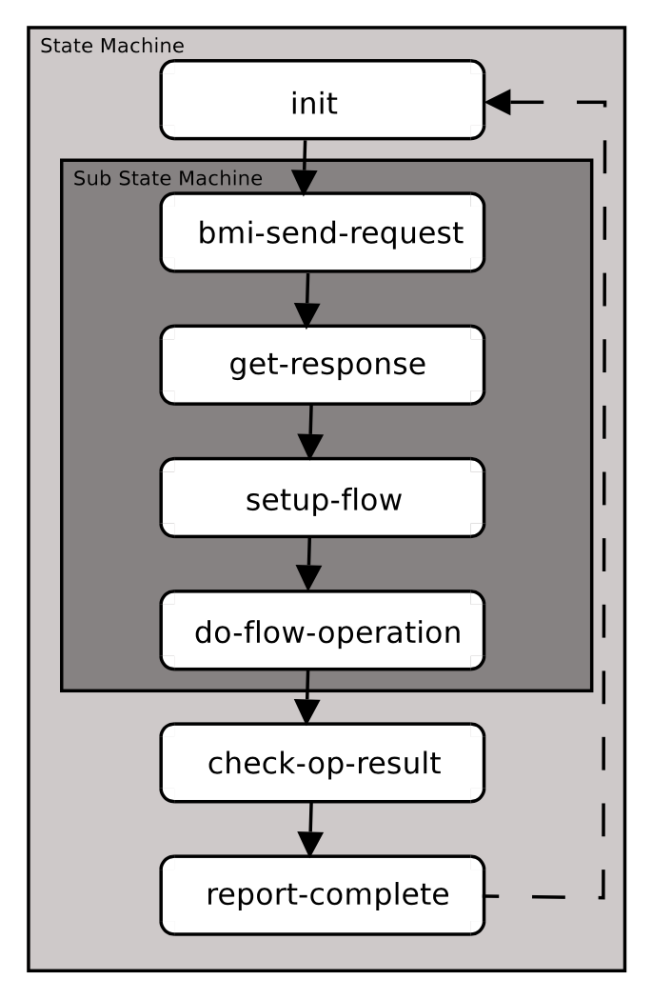

# `pvfs2-client` Design Document (DRAFT)

## Introduction

The primary role of the pvfs2-client daemon is to efficiently *marshal*
operation requests and data from the kernel’s VFS ( *Virtual File
System*, or *Virtual Filesystem Switch*) layer to the pvfs2-server, and
return responses from the pvfs2-server(s) back to the VFS layer. This
involves waiting for file system and I/O requests, performing operations
against the pvfs2-server application(s), and passing responses back to
the Linux kernel’s VFS layer. The data medium for the communication
between the VFS request and the pvfs2-client application is the
/dev/pvfs2 device node. An interface that will allow incoming unexpected
requests from the /dev/pvfs2 device node is required, and using the
existing BMI interface is preferred.

Figure 1 illustrates the architecture of several components of PVFS2.
This document will focus specifically on the pvfs2-client application.


*Figure 1: High Level PVFS2 Architecture*

## Motivation for the `pvfs2-client` Application

Currently, our entire code base exists as user space code. This includes
all of our networking support (through the *BMI* and *Flow Interfaces*),
and our non-blocking request handling architecture through the *Job
Interface*. The pvfs2-server already uses these interfaces to manage
multiple simultaneous operations in flight at once. Similarly, it is
highly desirable to have a pvfs2-client application that can issue and
manage multiple simultaneous operations at once when communicating with
the pvfs2-servers. Therefore, at least in the short term, it would be
most appropriate to leverage as much of our existing code as possible. A
user-space application is required to make use of this code, and thus
the need for the pvfs2-client application to bridge the gap between the
Linux kernel’s VFS layer and the *System Interface*.

## `pvfs2-client` Application Architecture

The pvfs2-client application consists of a set of state machines roughly
corresponding to all file system and I/O operations that can be
requested from the VFS. At a high level, the pvfs2-client application
appears to share a common architecture with the pvfs2-server
application. The most notable distinction between the pvfs2-client
architecture and the pvfs2-server architecture is the source of the
unexpected requests. On the pvfs2-server, unexpected requests come from
over the network through the BMI Interface. The pvfs2-client receives
unexpected messages from the /dev/pvfs2 device node. It would be ideal
if the BMI Interface could be used to monitor the /dev/pvfs2 device
node.

One responsibility of the pvfs2-client application is to wait for jobs
in progress to complete. Waiting on pending jobs is implemented as a
non-blocking operation against the existing job interface using the call
job\_testcontext. This call returns a list of unexpected or completed
jobs that were submitted previously by states of the various state
machine operation implementations.

For each job returned from job\_testcontext, the pvfs2-client
application checks if the job is an unexpected request. If the job *is*
an unexpected request, it initializes an appropriate state machine for
that job. Regardless of whether or not the job was unexpected, the state
of each job is advanced to the next until a blocking operation is
encountered.

Unexpected requests are delivered to the pvfs2-client application only
from the /dev/pvfs2 device node that the pvfs2-client application
monitors through the job interface. These requests are generated and
passed up from the Linux kernel’s VFS layer by the PVFS2 kernel module
that implements the VFS operations.

The pvfs2-client has a similar processing loop as the pvfs2-server:

``` 
    while (pvfs2-client application is running)
    {
      ...
      wait on pending jobs in progress and expected requests
      ...
      foreach job returned
         if job is an unexpected request
            initialize appropriate operation state machine
         end if
         ...
         while completions occur immediately
             advance to next state in state machine
         end while
      end foreach
    }
```

## Limitations of the Existing System Interface

Currently, all client interaction to a pvfs2-server is done through the
*System Interface* API. This interface provides a set of file system and
I/O operations to be performed against the pvfs2-server(s), but suffers
from several major limitations in its current state. These limitations
can be described briefly as:

  - *Semantic Limitations*: the current implementation provides a
    blocking interface to all operations. We already know that a
    non-blocking interface is required for efficient access through
    other existing non-blocking iterfaces such as ROMIO.

  - *Reusability Limitations*: the current implementation performs many
    blocking operations. This cannot be used *as is* in the proposed
    non-blocking state-machine oriented architecture of the
    pvfs2-client.

A proposed redesign of the System Interface implemented in terms of
reusable state machines can solve these limitations, as discussed below.

## `pvfs2-client` Request Servicing

Operation request servicing in the pvfs2-client application will be
implemented by state machines. That is, for each type of request that
can be handed up from the PVFS2 kernel module, a matching state machine
will exist to service it. The types of operation requests required will
roughly correspond to all of the possible operations available through
the System Interface API. For the proposed pvfs2-client architecture, it
is clear that a non-blocking implementation of the System Interface is
desirable for the state machine architecture. Further, to encourage code
re-use, each operation in the *System Interface* can be expressed as a
state machine. Implementing the core functionality of the System
Interface methods in terms of state machines allows an opportunity for
blocking *and* non-blocking interface implementations, heavier code
re-use, and design simplicity.



*Figure 2: Operation Servicing State Machine (w/ nested core state machine)*

We can think of all pvfs2-client operations as having a similar
structure, as depicted in Figure 2. What we see here is a generic state
machine implementing an operation. For all operations there will be a
*use specific* initialization, execution of some core routines (
i.e. functionality provided by the current System Interface), and a
use-specific notification of status and completion. If the core
functionality of each System Interface routine were implemented in terms
of a state machine, the execution of a core routine could be embedded as
a nested state machine within the operation specific state machine.

Figure 2 shows a complete operation state machine, along with the
embedded (nested) state machine that implements core functionality of a
System Interface call. The first state called *init* represents the use
specific initialization state. Each operation may have a different
initialization phase, but at the very least, the source and target
endpoints for the Flow (to be performed inside the nested state machine)
are selected. Following initialization, the nested state machine is
executed, performing the core operation requested. After this, the
operation state machine checks the status of the performed operation to
properly handle error reporting. Finally, the state is advanced to the
initial state of the state machine, which is the default action when the
operation has completed.

In order to represent the core functionality of a System Interface
method as a re-useable state machine, we must take advantage of the
source and target endpoint specifications allowed by the existing *Flow
Interface*. Assuming it is possible to know the source and target
endpoints of the Flow prior to executing the System Interface core
functionality, it can be re-used by embedding it as a nested state
machine in the pvfs2-client architecture, *and* shared between the
blocking and non-blocking System Interface implementations. The
requirement for this is that the source and target endpoints of the Flow
be established before using the core functionality state machine. In
Figure 2, for example, the pvfs2-client application may specify that the
Flow’s target endpoint should be the /dev/pvfs2 device node.

## Non-blocking and Blocking System Interface Implementations

Non-blocking and blocking System Interface methods (as shown in Figure
3) can use the same core functionality once implemented as a state
machine. The blocking version will manually advance the state machine
internal to the call and not return until the operation has completed.
The non-blocking implementation will start the state machine and offer a
mechanism for testing operation completion. For the non-blocking
interface, some method of asynchronous progress must be provided. This
can be done either with a background thread, or completing work during a
test for completion.
